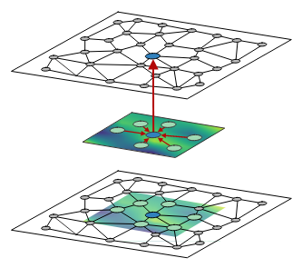

# Deep_Spammer_Detection_GCN

The idea with this project is to classify whether the nodes in a graph are spammers or not.

## Introduction

A  large  amount  of  data  in  practical  tasks  naturally  comes in the form of irregular, non-euclidean structures; e.g. graph data or meshes. Many real-life representations such as social networks, maps, molecular structures take this form. GCNs  transfers  the  high  performance  of  traditional convolutional neural networks to this kind of data. These set of methods got recently brought together under the term geometric deep learning. 

### The input data

A graph convolutional network takes a graph G = (V, E), as input, represented in the following way:

* Node features: N x D where N is the number of nodes and D is the number of features
* Matrix representation: 2 x L where L is the number of edges in the graph
* Edge attributes: L x R where L x R where R is the number of features per node

### The convolutional operations

Node features are extracted by convolution operators that aggregates node features in local neighborhoods weighted by a trainable, continuous kernel function. An example of spatial aggregation in geometric deep learning with trainable, continuous kernel functions for image graph representations can be seen below:

 

  

                                                      (image source: https://arxiv.org/pdf/1711.08920.pdf)

## The data

We generate a graph that tries to depict an internet network with spammer nodes and non-spammer nodes.

Spammer have the following similarities:

* They have more edges (connections to different computers)
* A high edge value associated to the nodes they are connected to (depicting the amount of bytes they transfer via email to their neighbours)
* Each spammer has an high associated node value (depicting the level of certainty that it is a spammer). If the node is more likely to be a spammer then the value will be closer to 1.

Non-spammers have the opposite characteristics

## The network

We use a stack of spline convolutions with exponential ReLU and dropout for regularization. The metric used is nll_loss which can be used for classification of arbitrary classes.
